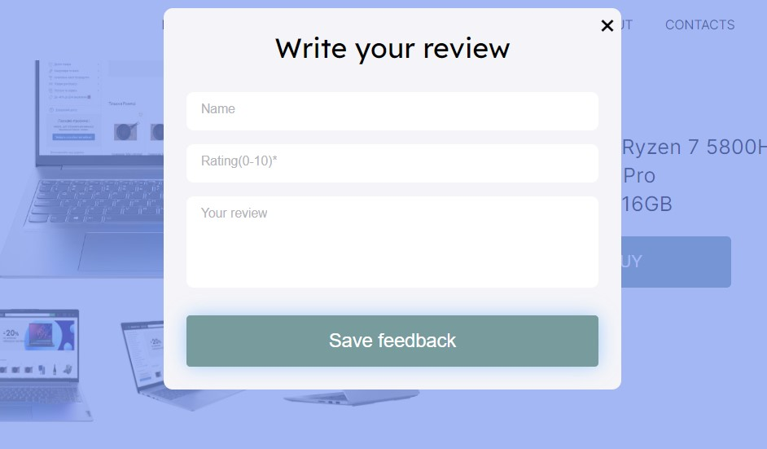

<h1 align="center">Web Store "CALIFORNIA"</h1>

<h3 align="center">The project of a modern online store</h3>

- **Technologies used**:

- **SPA - Single Page Application**
- **Backend implementation for sending and receiving data**

<h3 align="center">How to start a project:</h3>

- in the root folder in the terminal enter: **npm i**
- run command **gulp**

Launch terminal 2 (for backend operation):

- in the terminal go to the folder "server": **cd server**
- enter: **npm i**
- then to folder "js": **cd js**
- run command **node app.js**

Use file INDEX.HTML from folder "build"

<h2 align="center">Project details</h2>

- **Slider**

- **Drop-down menu**

- **Product catalog with the ability to filter and sort**

- **Personal page with a list of completed orders**

- **Using modal windows**

- **Shopping cart with the ability to delete and change the number of products**

- **Product page with product details and photos**

- **Product feedback form**

- **Order form (order information sent to the backend and displayed in the personal page)**

